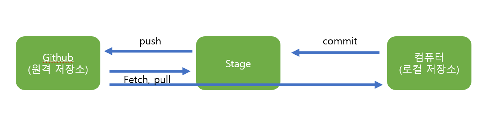
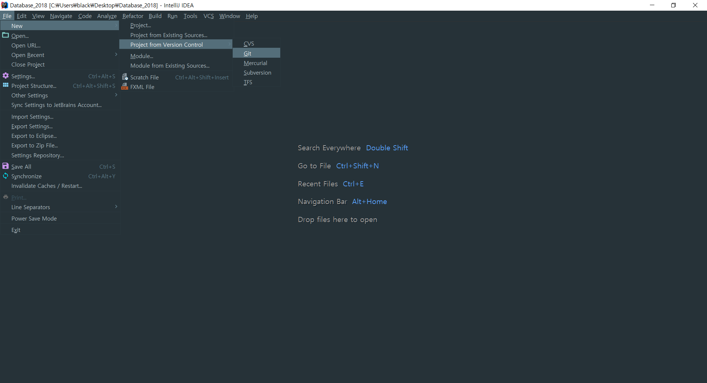
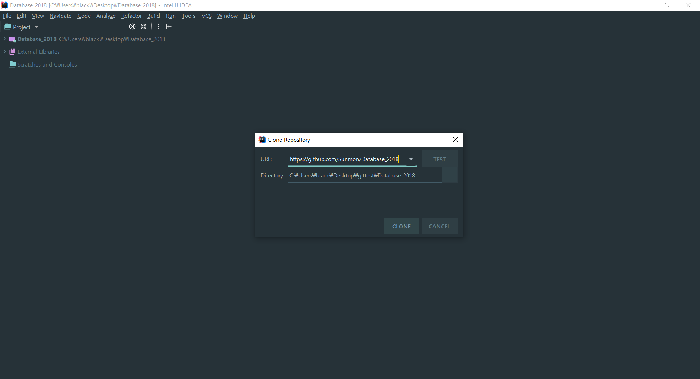
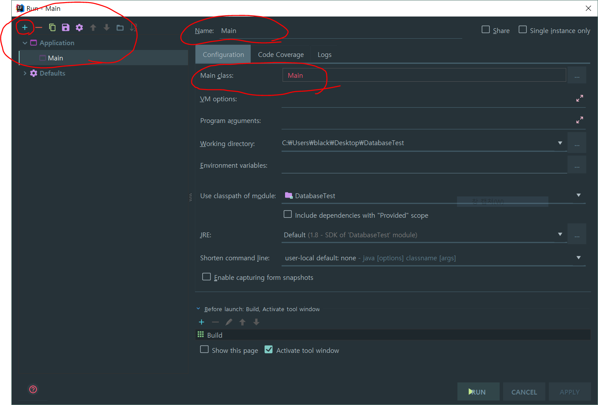
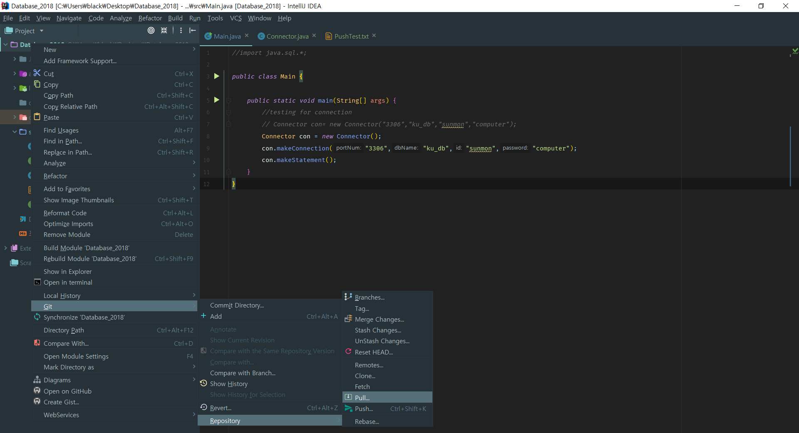
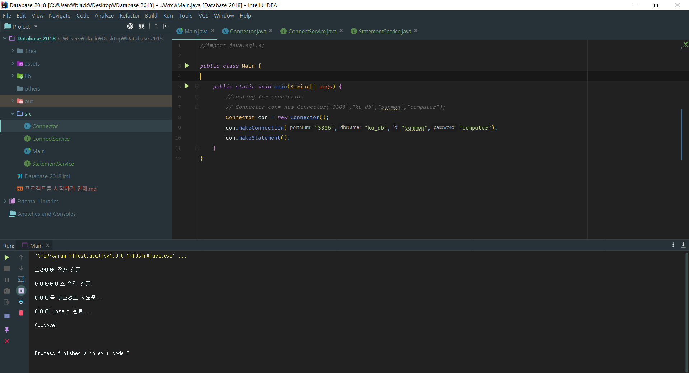
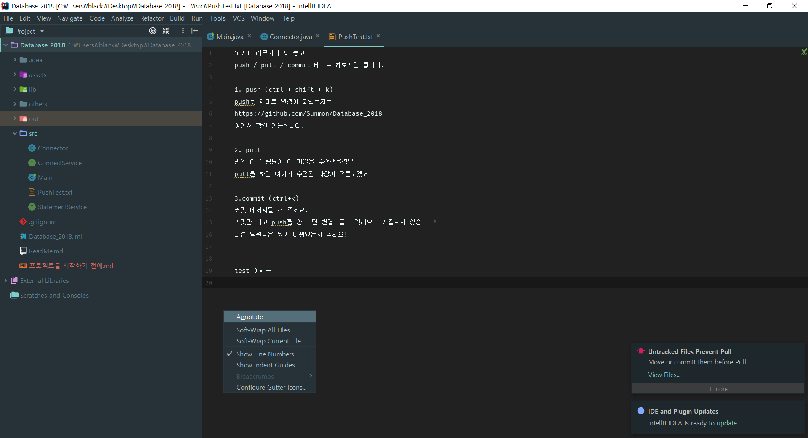
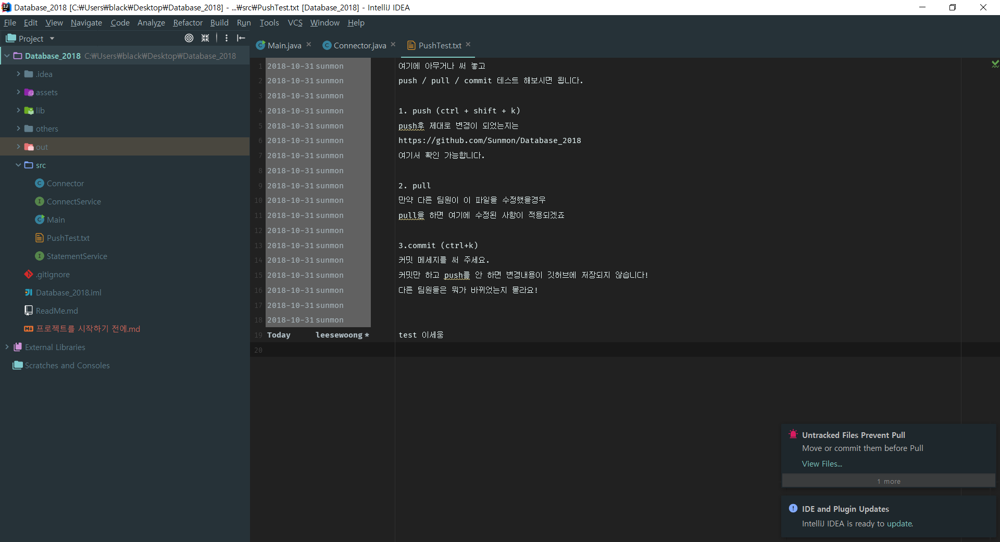
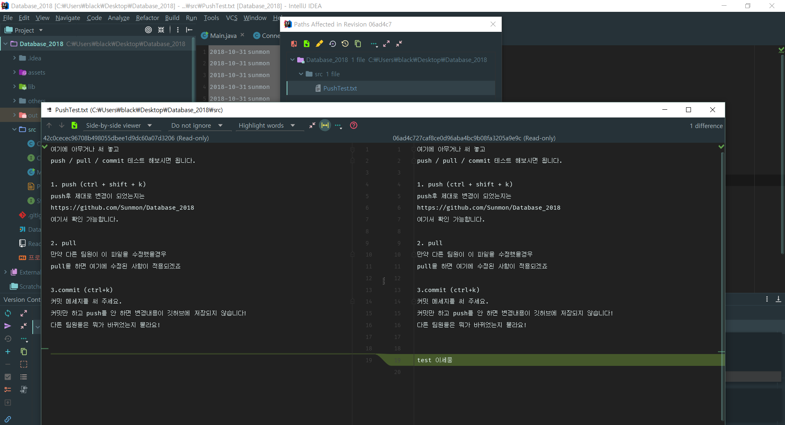

# 프로젝트를 시작하기 전에

```
2018-10-27 최초 작성
2018-11-02 기능 설명 추가(Annotatation, Alt+`)
```


project를 만들었습니다.

jdbc연결 코드도 작성했습니다. 각자 db에 맞도록 id/ password/ db이름을 변경하셔서 쓰시면 됩니다.

fetch/ pull / push/ commit이 잘 되는지 확인해주세요.


### 간단한 기능 설명
1. fetch : github에서 local로 프로젝트를 받아옵니다.
2. pull : repository에 변경사항이 있는지 확인하고 변경된 점을 적용합니다.
3. push : 프로젝트를 github에 올립니다. github에 동기화시킵니다.
4. commit : 중간 작업 단계를 저장하고 어떤 점이 바뀌었는지를 서술합니다. 커밋 메세지 제목은 한 줄로, 그리고 두 줄 띄운 후 상세정보를 입력해 주세요.

* 프로젝트는 commit후 push 할 수 있습니다.

* commit - pull - push 순서를 권장합니다.

* github 간단한 설명 :
  https://github.com/sejong-interface/Interface_Manual/wiki/Git-%EC%8B%9C%EC%9E%91%ED%95%98%EA%B8%B0%232--%EC%BB%A4%EB%B0%8B,-Pull,-Push,-%ED%8E%98%EC%B9%98%ED%95%B4%EB%B3%B4%EA%B8%B0

* intelliJ에서 git쓰기: 

  https://www.jetbrains.com/help/idea/using-git-integration.html





---


### FETCH

github에서 intelliJ로 (원격 저장소에서 자신의 프로젝트 파일로) 프로젝트 import하기.

```
<FETCH>
1. File- New - Project from Version Control - Git
2. git repository 주소 넣기 & 로컬 저장소 설정
3. CLONE
4. (만약 빈 화면만 뜬다면) Alt + 1
```

프로젝트 잘 복사되었는지 확인.







**alt + shift + f10 - Main으로 실행.** 


> 실행이 안 될 경우

alt+shift+f10누른 후 Edit configuration...

왼쪽위 +버튼 누르기 - Application 추가

Application 이름 / Main class에 메인 클래스 이름 넣어주기(public static void main()있는 클래스)




### Commit

프로젝트에 변경사항이 있을 경우 commit을 해 준다.

단축키: Ctrl+ K

로컬 저장소(내가 수정하는 코드들)- 중간 단계(commit, 로컬에 저장) - 원격 저장소(git, 팀원들과 공유)

DB에서 커밋하는거나 똑같음. 다만 commit만 하면 개인적으로만 저장 되고, 따로 Push를 해줘야 원격 저장소에도 변경점이 저장되는 것. commit여러번 하고 한번에 Push해줘도 된다.


commit할때는 commit message를 쓴다.

첫 줄에는 간단하게 변경점이 뭔지 써준다.

한 줄을 띄운 뒤 자세한 설명을 쓰면 된다.(팀원들이 대략 변경사항을 파악할 수 있도록)


(사진생략)


### Push

push는 로컬에 저장한 commit한 내용들을 원격 저장소로 올려준다.  push를 해야 다른 팀원들과 코드를 공유 할 수 있다!!

단축키: Ctrl + Shift + K

push할 branch를 골라서 push 하면 되는데... master branch가 github의 중심기둥, origin이 local repository의 중심기둥이란거만 기억하면 된다. 

branch는 master외에도 다른 버전?같은것들을 만들어 주는건데, 잘 안써봄. branch에 대해 자세한건 구글링.

(사진생략)


### Pull

가끔 push를 하면 충돌이 일어날 때가 있다.

원격저장소의 내용을 내 local로 복사해서 수정하고 있는데, 그 원격 저장소에 다른 팀원이 push를 하면 원격 저장소와 내가 복사한 버전의 원격 저장소가 다르다. 그러면 충돌이 난다.

그럴 때는 pull을 이용해서, 팀원들이 수정한 부분을 내려받고, 혹시 내가 코드를 작성한 부분과 충돌이 일어나진 않는지 확인 후 push하면 된다.





### git에 올리는 과정

1. Commit
2. Pull
3. Push

순서대로 하면 됩니다.


### TEST

연결 잘 되나 테스트..

일부러 insert 되는지 확인하려고 makeStatement메소드에 insert 기능을 넣었습니다

실행 결과(단축키 Alt + Shift+ f10)가 아래 사진처럼 오류 없이 잘 돌아가는지 확인해주세요.



혹시 `java.sql.SQLIntegrityConstraintViolationException: (conn=74) Duplicate entry '23411' for key 'PRIMARY'` 오류가 뜬다면

makeStatmet의 `String sql = "INSERT INTO instructor " + "VALUES ('23411', 'test1031', 'Comp. Sci.', 50000)";`부분을 수정해주시면 됩니다. 23411을 다른 숫자로 바꾸세요.


## 고급 기능

### Annotate

누가 언제 어디를 수정했는지 보여줍니다. 마우스를 가져다대거나 클릭하면 상세 설명이 나옵니다.









### Alt + ` :: VCS Operation

`Alt`+ `` ` 키를 누르면 VCS 옵션들을 한번에 볼 수 있습니다.


